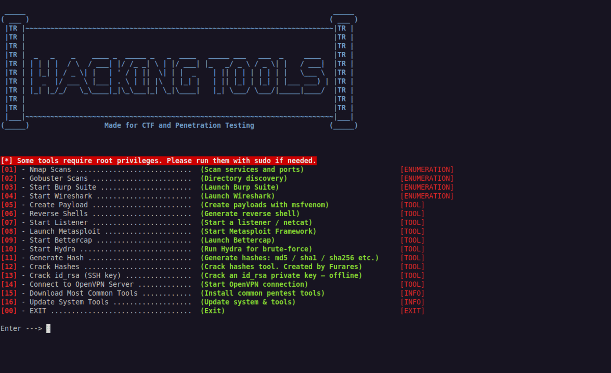

# 📘 ffurares Cybersecurity Automation Tool

  

---

## ⚠️ Yasal Uyarı (Disclaimer)

Bu araç yalnızca eğitim, CTF çalışmaları ve etik siber güvenlik araştırmaları için tasarlanmıştır.

- Yetkisiz sistemlerde kullanımı yasadışıdır.  
- Araç yalnızca Kali Linux üzerinde test edilmiştir.  
- Her zaman etik kalın. Yetkisiz test yapmayın.  
- Yazar, kötüye kullanım sonucunda doğacak herhangi bir sorumluluk kabul etmez.

---

## 📖 Araç Hakkında

**ffurares Cybersecurity Automation Tool**, başlangıç seviyesinden ileri seviyeye kadar kullanıcılar için tasarlanmış çok amaçlı bir güvenlik otomasyon aracıdır.

Popüler araçları tek bir arayüzde toplar ve test süreçlerini kolaylaştırır.  
Python ve Bash Script ile geliştirilmiştir.

---

## 🚀 Temel Özellikler

| Özellik | Açıklama |
|---------|----------|
| 🔑 Hash Cracker | Brute-force veya wordlist ile hash kırma |
| 🧩 Hash Generator | MD5, SHA1, SHA256 hash üretme |
| 🌐 Nmap Scanner | Ağ tarama ve servis keşfi |
| 🚪 Gobuster | Dizin ve dosya brute-force |
| 💣 MSFVenom | Payload oluşturma |
| 🕵️ Metasploit | Exploit işlemleri için entegrasyon |
| 🔄 Reverse Shell | Hazır reverse shell payload’ları |
| ⚙️ System Update | Kali Linux sistem güncelleme |
| 🕸️ Burp Suite | Web uygulama güvenlik testi |
| 📡 Wireshark | Ağ trafiği analizi |
| ⚡ Bettercap | MITM ve gelişmiş ağ testleri |
| 🔐 OpenVPN | VPN bağlantısı kurma |
| 🧪 Hydra | Çoklu protokoller için parola brute-force |
| 🔑 SSH Key Test | SSH anahtar test işlemleri |
| 📥 Tool Downloader | Yaygın pentest araçlarını otomatik indirme |

---

## 🎬 Demo

GIF veya ekran görüntüsü ekleyebilirsin:

```markdown

